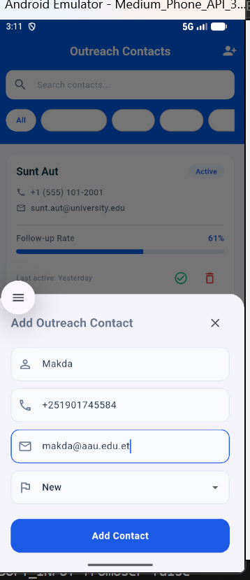
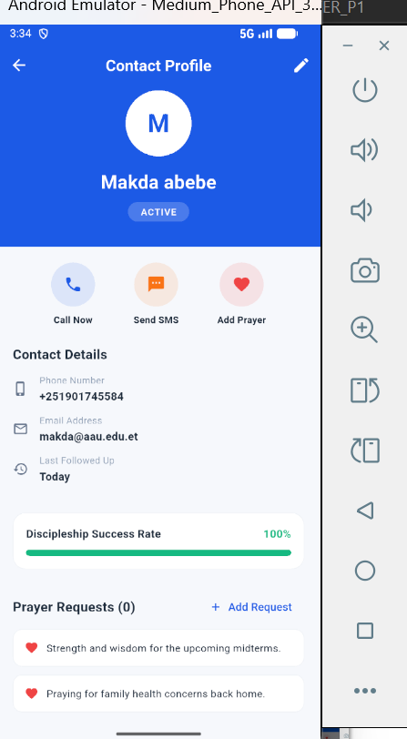
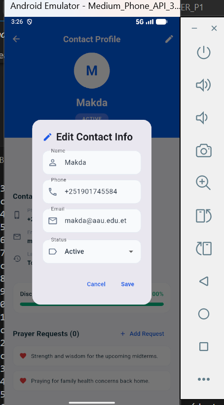
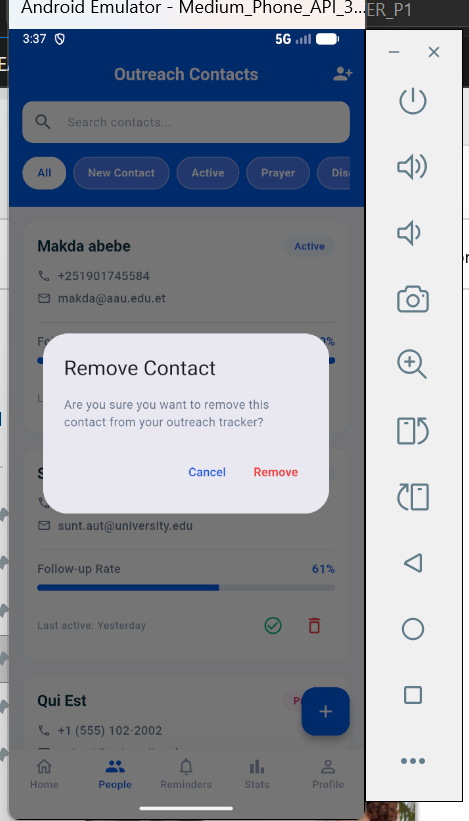
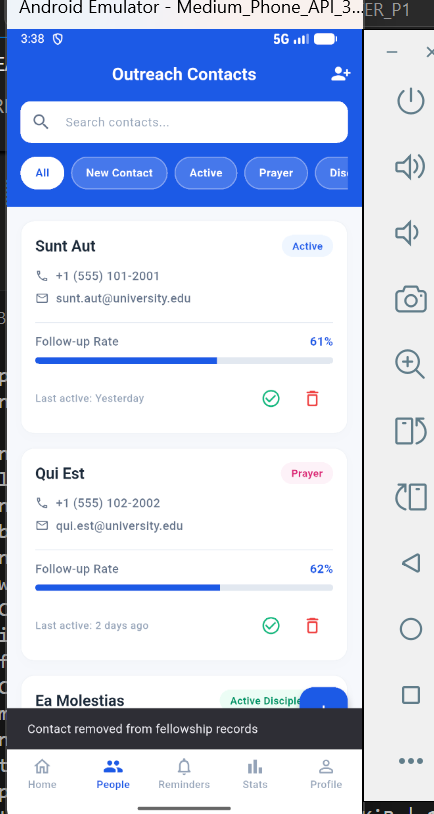
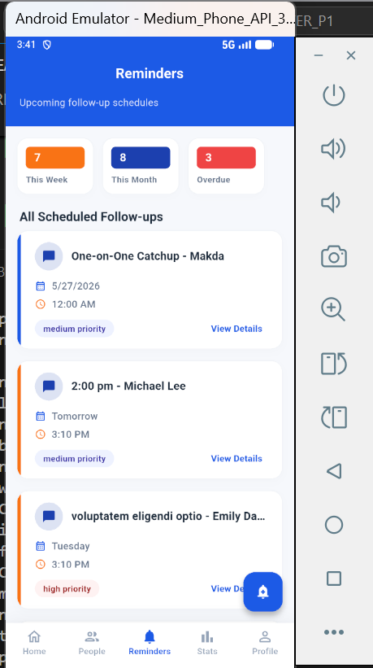
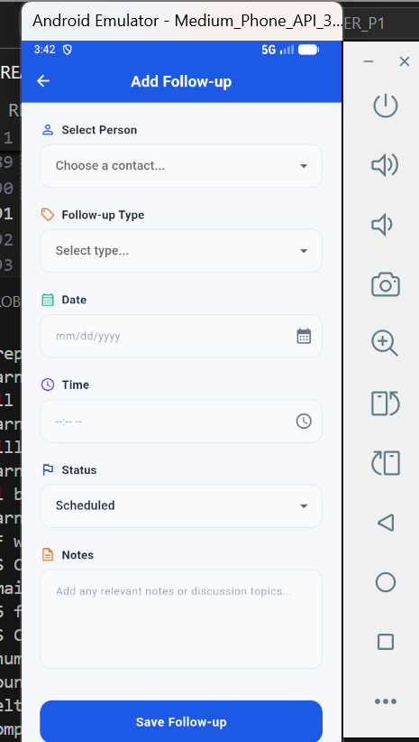
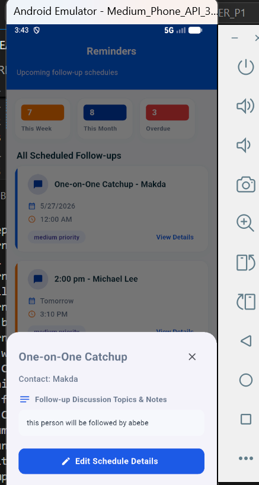

# Outreach Follow-up App

A Flutter mobile application for managing university fellowship outreach and follow-up activities.

This project was developed as part of a CRUD API consumption assignment using Flutter, Provider state management, and the HTTP package.

---

## Features

- View outreach follow-up records
- Add new outreach contacts
- Update follow-up status
- Delete outreach records
- Manage outreach notes
- Clean and responsive UI
- Loading and error handling states
- REST API integration

---

## Technologies Used

- Flutter
- Dart
- Provider State Management
- HTTP Package
- REST API (JSONPlaceholder)

---

## Project Structure

```bash
lib/
│
├── models/
├── providers/
├── services/
├── screens/
├── widgets/
└── utils/
```

---

## API Used

This project uses the public REST API from:

https://jsonplaceholder.typicode.com/

---

## CRUD Operations

| Operation | HTTP Method |
| --------- | ----------- |
| Create    | POST        |
| Read      | GET         |
| Update    | PUT/PATCH   |
| Delete    | DELETE      |

---

## Screenshots

### Home Screen


### Add Person Screen



### Detail Screen



### Edit Screen



### Delete page



### Delete confirm



## Follow up reminder



### Add followup



### Edit follow-up



### Clone the repository

```bash
git clone https://github.com/TsionAlemu1/Outreach_Follow-up_App.git
```

### Install dependencies

```bash
flutter pub get
```

### Run the application

```bash
flutter run
```

---

## Dependencies

```yaml
provider:
http:
```

---

## Author

Developed by [Tsion Alemu]

---

## Assignment Requirements Covered

- CRUD API consumption
- HTTP package integration
- Provider state management
- Clean project structure
- Error handling
- Loading states
- GitHub repository management
